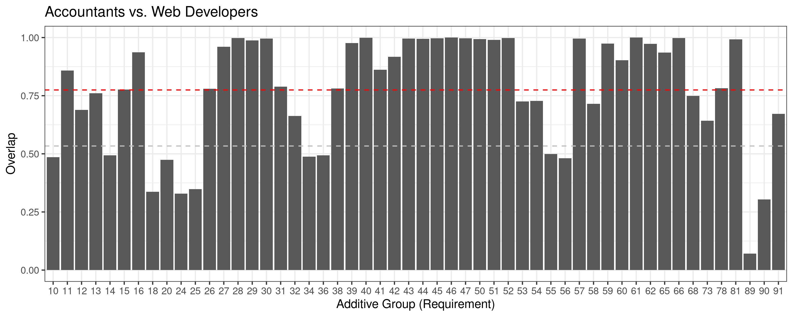
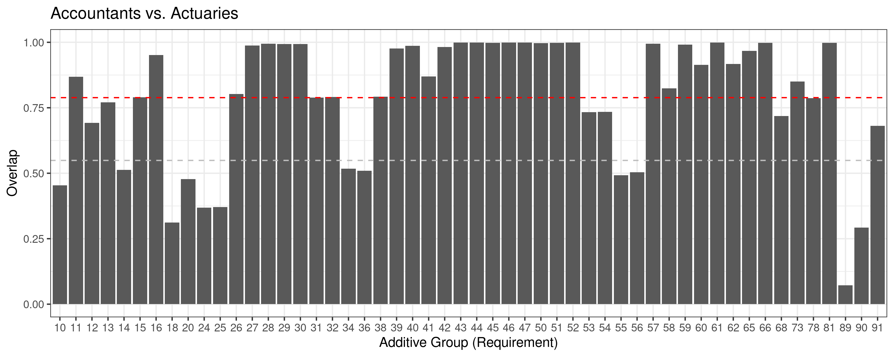
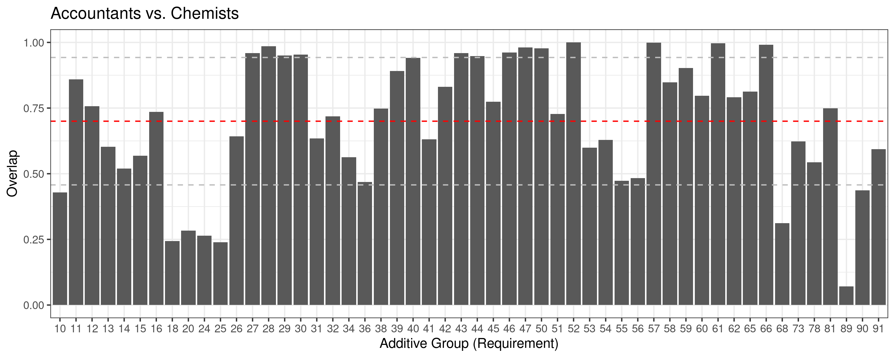
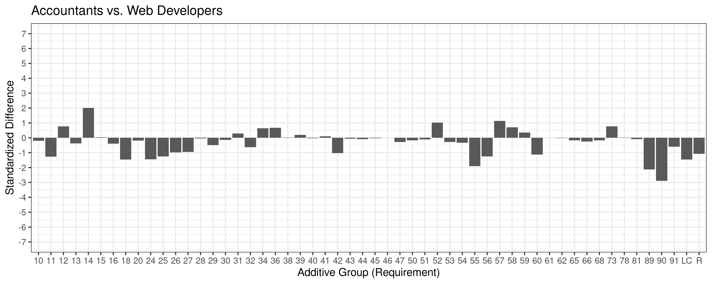
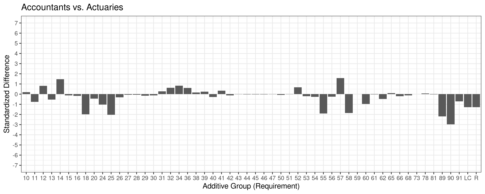
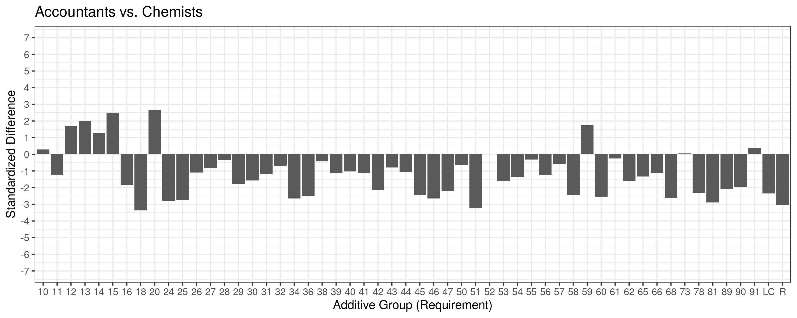

The imputeORS package provides to tools to impute missing values in the Occupational Requirements Survey (ORS) administered by the U.S. Bureau of Labor Statistics (BLS). It uses an iterative, machine learning based approach. The package contains functions to retrieve, process, and analyze the data, and produces useful visualizations of both the iterative process and the final imputed results. In this vignette, we go through the full analysis stream for a subset of the data.


# Overview of ORS Data

**Occupational Requirements Survey.** The Bureau of Labor Statistics (BLS) collects numerous data to capture important information regarding the workforce in the United States. One of the tools they use to do this is the [Occupational Requirements Survey](https://www.bls.gov/ors/) (ORS), which is a comprehensive survey that gathers information regarding the various demands and conditions (requirements) of different occupations within the U.S. economy. These requirements fall into one of four categories: physical demands; environmental conditions; education, training, and experience; and cognitive and mental requirements. The initial data that were analyzed were publicly available datasets known as "Wave 1" and "Wave 2." The survey is accomplished in repeated waves across several years; the data analyzed from the public set constituted Wave 1, year 2 and Wave 2, year 1. In this vignette, we focus exclusively on a subset of the Wave 1 data.


**Structure of ORS Data.** The data used in this vignette are publicly available from the BLS  ORS, and are included within the `imputeORS` package. Importantly, this survey captures the distribution for the *minimum* job requirements of various occupations, rather than the *actual qualifications* of individuals working in these occupations (i.e., the survey does not capture information of under- and/or over-qualified employees). Additionally, this dataset covers only civilian occupations.

Numerous types of data are captured in the ORS so we focus on the information we identified as relevant to our goal of imputing missing estimates for population distributions of occupational requirements. For any given observation, the relevant fields utilized from the ORS were as follows:

- `upper_soc_code`: Numeric field | Classifies occupation using the [Standard Occupational Classification (SOC) system](https://www.bls.gov/ors/notices/2020/implementing-2018-soc.htm)
- `occupation_text`: Character field | Descriptive text of occupation
- `data_element_text`: Character field | Descriptive text of job requirement/demand 
- `data_type_text`: Character field | Descriptive text of levels associated with any given requirement/demand
- `estimate_type_text`: Character field | Describes type of measurement associated with observation (either "Estimate" or "Standard Error")
- `estimate_type`: Character field | Further describes type of measurement associated with observation (our focus was on observations described as ``Percent")
- `unit_of_measure`: Character field | Describes units of measurement associated with observation (our focus was on observations described as "Percentage")
- `additive_group`: Numeric field | Exhibits one-to-one correspondence with `data_element_text` (i.e. requirement). Importantly, estimates of observations belonging to a given `occupation_text` within a specific `additive_group` should sum to 100%; we will refer to these distinct combinations of occupation and requirement as ***occupational groups*** moving forward
- `value`: Numeric field | Measurement estimate (our focus was on percentage values describing mean distributions of requirements)


# Preprocessing    
```{r, include=FALSE}
knitr::opts_chunk$set(
  collapse = TRUE,
  comment = "#>"
)
```
The preprocessing stage, involves a number of steps, detailed below.

**Raw Data and Transform.** First, we obtain the raw data from the ORS website, and transform it into the format used by the package. We see a sample of this transformed data, below.

```{r setup, echo=FALSE,message=FALSE}
library(imputeORS)
library(tidyr)
library(ModelMetrics)
library(ggplot2)
library(RColorBrewer)
library(ComplexHeatmap)
library(kableExtra)
library(knitr)
load("../data/estim_ssa_output_2018.Rdata")
ors.from.csv[c(751,3000,10001,50000,65001,70000),c(6,7,9,10:16)]
```

**Synthetic Additive Groups and Filtering.** Next, we manually create a handful of additive groups using the available data, a step that was added on the advice of SSA analysts. These groups are:

- Literacy required (11)
- Pre-employment training: Certification (89)
- Pre-employment training: License (90)
- Pre-employment training: Educational Certificate (91)
- Sitting or standing/walking (78)

The numbers assigned to these synthetic additive groups are derived from the `reference_group` field associated with the relevant observations. After the creation of these groups, we trim the data to only include observations associated with a valid additive group. This is all accomplished using the function `syntheticAddGroups()`, below.

```{r preproc1, cache=TRUE}
x <- syntheticAddGroups(ors.from.csv)
```

**Missing Observations and Corrections.** Once the data is trimmed, we then go about the task of "completing" the data. One of the gaps in the data is the fact that some observations within an occupational group are unlisted (i.e., not only is the estimate missing, but the observation itself is not in the original data). To fix this issue, we generate all possible levels within a given occupational group, and then merge these observations with those available in the original dataset to produce a "complete" dataset. This is accomplished using the `fillMissingObservations()` and `otherMissingObservations()` functions. Note, because these additional observations do not have estimates associated with them, they become part of the imputation problem moving forward. Some additional corrections are also applied here (see function `dataCorrections()` for more details).

```{r preproc2, cache=TRUE}
x.complete <- fillMissingObservations(x)
x.complete <- otherMissingObservations(x.complete)
x.complete <- dataCorrections(x.complete)
```

**Separate Means and Errors.** In this step we separate the complete data into two data frames: one exclusively containing mean estimate observations, and another exclusively containing error observations. These are merged in a later step such that rather than having separate observations for the estimate and error for a given measure, they are assigned to the same observation (wide data rather than long data).

```{r preproc3, cache=TRUE}
x.complete.means <- getMeanEstimates(x.complete)
x.complete.errors <- getErrors(x.complete)
```

**Direct Calculation.** Some of the observations with missing estimates (including some of those generated by data completion) can be filled in based on the available information. For example, some requirements are binary in nature, e.g. the requirement *Prior work experience* has only two levels: YES, and NO. Given one estimate, the other can be calculated. Similarly, for requirements where all but one estimate was known, the final one can easily be determined. Each occupational group is assessed to determine whether it is such an "N-1 group," and those that are have their missing estimate calculated and added to the data.

```{r preproc4, cache=TRUE}
ors.data <- fillNminusOneGroups(x.complete.means)
```

**Assign Errors, Bounds, Predictors, and Weights.** In this step, we format the data for modeling. We first assign the errors to their relevant observations, and add bounds to each estimate based on the errors (where available). For observations missing an estimate/error, the bounds were calculated based on the remaining available percentage within the occupational group. We also add predictor columns, derived from the requirement categories, requirements, and requirement levels associated with each observation. This mapping is stored in a variable called `predictors.data`, a sample of which is shown below. Finally, we add default modeling weights to each observation, based on the presence/absence of an estimate.

```{r predictors.data, echo=FALSE}
imputeORS:::predictors.data[11:20,]
```

```{r preproc5, cache=TRUE}
ors.data <- errorsAndBounding(x.complete.errors,ors.data)
ors.data <- getPredictors(ors.data)
ors.data <- setDefaultModelingWeights(ors.data)
```

Note that here we remove all observations associated with the `occupation_text` *All Workers*, and we would advise doing the same, because it is a summary measure of all occupations considered in the ORS. For the purposes of this vignette only, we consider just four of the 22 possible 2-digit SOC codes. We include Table \@ref(tab:soc2tab), listing the number of observations associated with each of the SOC2 codes retained. A guide to these codes can be found online at the [BLS website](https://www.bls.gov/soc/2018/major_groups.htm). We also provide a snapshot of the data.

``` {r subset, cache=TRUE}
ors.data <- droplevels(ors.data[-which(ors.data$occupation_text=="All Workers"),])
ors.data <- droplevels(ors.data[which(ors.data$upSOC2 %in% c("11","13","15","19")),])
```

``` {r subset-soc2, echo=FALSE}
table(ors.data$upSOC2) %>% kable(col.names=c("SOC2 code","Count"),table.attr="style='width:40%;'",
                                 row.names=FALSE,label="soc2tab",format="html",longtable=T,booktabs=T,
                                 caption="Number of observations for each of the included SOC2 groups.") %>%
  kable_styling(latex_options=c("repeat_header"),font_size=12)
```

``` {r subset-snapshot, echo=FALSE}
temp <- head(ors.data,20)
rownames(temp) <- NULL
temp
rm(temp)
```


# Model Tuning

Next, we run through an example of model tuning. Our approach broke this down into two stages: train-test, and k-folds cross validation. Both stages utilize an interative modeling approach. Model tuning is accomplished using only the known data (in order to generate "predictions," a subset of the data is thrown out at the beginning of each procedure).

## Train-test

The train-test paradigm was used to determine the model parameters to use moving forward, specifically the parameters *nrounds*, *max_depth*, and *eta*. In practice, this procedure was run multiple times until we optimized the parameters. Here, we simply run it once with the final parameterization that was obtained. The data are first separated into train/test/validate sets, and then smart guessing followed by iterative model prediction is applied to the test set.

```{r traintest, cache=TRUE,echo=TRUE,message=FALSE}
model.results <- iterateModelTT(ors.data=ors.data,
                                n.iter=5,weight.step=0.05,
                                mdl.d=14,mdl.n=200,mdl.e=0.6)
```

## K-folds Cross Validation

Next, we used k-folds cross validation (KFCV) to determine the *blending ratio* for our ensemble method. This approach first involved using the `smartGuess()` function to generate an initial prediction for the "missing" values, and then using an iterative modeling procedure to refine these predictions. The full process involved running the KFCV paradigm twice: once using SOC2 codes to guide smart guessing, and once using SOC3 codes. The results of these models were then blended using a ratio calculated from the convergence iterations of the individual models.

**K-folds Cross Validation Modeling.** During the modeling stage, the predictions are initialized using smart guessing and then refined in an iterative fashion that leverages XGBoost. Once this was done using both the SOC2 and the SOC3 codes to guide smart guessing, the data from each of the test folds from each prediction were collated to generate a "full" predicted dataset for each iteration. The results of this collation from the SOC2 model are shown below, with *Prediction0* corresponding to the output of the smart guess procedure, and all subsequent predictions corresponding to those generated by the iterative modeling process. Note that in these results, the first column *fold* indicates which fold a given observation belongs to, the second column *req.cat* indicates the requirement category of the given observation, and the third column *actual* gives the actual value of the estimate (before it was thrown out).

```{r kfcv1, cache=TRUE,echo=-1,message=FALSE,warning=FALSE}
library(doParallel)
# Use SOC3 codes to guide smart guessing, and model
soc3.mdl <- iterateModelKFCV(ors.data=ors.data,
                             n.iter=10,weight.step=0.05,
                             mdl.d=14,mdl.n=200,mdl.e=0.6,
                             fold.list=NULL,sg.soc.code="upSOC3")

# Use SOC2 codes to guide smart guessing, and model
# Use the folds generated during the SOC3 phase
fl <- soc3.mdl$folds
soc2.mdl <- iterateModelKFCV(ors.data=ors.data,
                             n.iter=10,weight.step=0.05,
                             mdl.d=14,mdl.n=200,mdl.e=0.6,
                             fold.list=fl,sg.soc.code="upSOC2")

# Get test fold data
test.folds2 <- getTestFoldData(soc2.mdl)
test.folds3 <- getTestFoldData(soc3.mdl)
head(test.folds2)
```

**Model Convergence.** After running the models, we determine the iteration at which they converge. The predictions from this convergence iteration (calculated for both the SOC2 and SOC3 models) are eventually used to determine the *blending ratio* that will be used for the purposes of imputing missing values at a later step (see \@ref(impute-missing-values)). Convergence is defined as when the difference in root mean square error (RMSE) between consecutive predictions is < 0.001. Note that in this vignette, because we are only using a subset of the data, the models never meet this convergence criteria. In this situation, the last iteration is returned as the convergence iteration (iteration 10, for both models).
```{r kfcv2, cache=TRUE,echo=TRUE,message=FALSE,warning=FALSE,fig.align='center',fig.width=4,fig.height=4,fig.cap="RMSE by iteration of SOC2 model."}
computeConvergence(test.folds2)
```

```{r kfcv3, cache=TRUE,echo=TRUE,message=FALSE,warning=FALSE,fig.align='center',fig.width=4,fig.height=4,fig.cap="RMSE by iteration of SOC3 model."}
computeConvergence(test.folds3)
```

**Determine Blending Ratio.** After determining the convergence iteration of each model, we then run an analysis to optimize the contribution of each model to the final prediction. The predictions from the two convergence iterations are blended in a ratio derived from minimizing the RMSE. From this analysis we arrived at a blending ratio of 46:54 (SOC2:SOC3). See below for the RMSE of predictions from each of the two analysis streams at the convergence iteration, as well as from the blended model. Figure \@ref(fig:blending) illustrates the blending ratio analysis. We report on this blended result in the next section. Importantly, this ensemble approach, and the ratio derived here, is also used throughout the remaining prediction steps, namely in \@ref(impute-missing-values).
```{r kfcv4, cache=TRUE,echo=TRUE,message=FALSE,warning=FALSE,}
blending.data <- computeBlendingRatio(soc2.mdl,soc3.mdl,print.plot=FALSE)

blending.data$soc2.proportion
blending.data$soc3.proportion

rmse(test.folds2$actual,test.folds2$Prediction10)
rmse(test.folds3$actual,test.folds2$Prediction10)
rmse(blending.data$test.folds.blended$actual,blending.data$test.folds.blended$Prediction10)
```

```{r blending, cache=TRUE,echo=FALSE,fig.align='center',fig.width=6,fig.height=3.75,fig.cap="Calculation of model blending ratio. The predictions at the convergence iteration of each of the constituent models were combined in various ratios, and the RMSE of the resulting blended prediction was calculated. The ratio that minimized this RMSE was 46(SOC2):54(SOC3), represented by the red point on the plot."}
blending.data$plot.blend
```

**Final Ensemble and Plot of Iterative Process.** A visualization of the iterative process can be seen in Fig. \@ref(fig:kfcv5). This visualization uses the blended, ensemble data, calculated from the ratio derived in the previous section. The actual value versus prediction is plotted to show the progression from the initial smart guess to the (adjusted) prediction for the each iteration of the model. With each iteration, XGBoost is moving the predictions towards their actual values: predictions are swept toward the diagonal at each step. Note that the blue points, representing the SVP requirement category which contains the requirement with the highest number of possible observations (*Minimum education level*, with 9 levels), have the furthest to move and have the highest error. Keep in mind that because this vignette only addresses a subset of the data, the convergence to the actual values is less pronounced than would be with the full dataset.

```{r kfcv5, cache=TRUE,echo=TRUE,message=FALSE,warning=FALSE,fig.align='center',fig.width=6,fig.height=16,fig.cap="Predicted estimates vs. their actual values by iteration. We can see a convergence of the predictions toward their actual values. Grey corresponds to ENV, yellow to PHY, and cyan to SVP."}
# Plot progression of (blended) predictions
p23 <- plotTestFolds(blending.data$test.folds.blended,print.plot=FALSE)
ggpubr::ggarrange(plotlist=p23,nrow=ceiling(length(p23)/2),ncol=2,labels="auto",legend="none")
```


# Imputation

Following model tuning, we address the original problem: imputation. This is carried out using the same iterative method utilized during tuning, however instead of operating on only the known data (and proxy missing data), it includes the actual missing data. Similar to the KFCV approach, the missing data is initialized with a prediction using smart guessing, and then XGBoost models are used to iteratively refine these predictions. However, it is important to capture some of the variability inherent in the data within the framework of imputation. To do this, we first create a set of *simulated* data, derived from the original known data. This is then used moving forward to generate a distribution of predictions for each the missing values, allowing for the calulation of confidence intervals rather than a single point estimate. The details of this procedure are demonstrated below.

## Simulation (Data Uncertainty) {#simulation}

Simulated data is drawn from a $\beta$ distribution using, for all known observations, the `value` field ($\mu$) for the mean and the `std.error` field ($\sigma_e$) as the standard deviation. The details of this calculation can be found in the [full paper](). As a result of this step, each known observation has, in addition to its original value, 10 simulated values associated with it, resulting in 10 simulated datasets.

<!-- The standard deviation is a function of the number of observations and $\sigma_e$, but we do not know the number of observations. Trial and error of different choices to match $\sigma_e$ yielded problems as the upper bound value of the standard deviation, due to the bounded nature of the potential values, is a function of the mean value used in the $\beta$ distribution. This is described as follows: -->

<!-- $$ \sigma<=\mu*(1-\mu) $$ -->

<!-- The maximum value $\sigma$ can take on is 0.25, which is when $\mu$ is equal to 0.5 . Note, as the value of $\mu$ approaches either 0 or 1, $\sigma$ approaches 0. -->
<!-- The variability in the data was significant, even using the lower value. If $\sigma_e$ was still too large to fit in the interval, the value was adjusted to be 95% of the upper bound. This occurred 2,446 times while there were 10,187 values that were inside the limit. -->

<!-- With this in mind, we moved on to generating the simulations. Given some occupational group with observations $\{x_i\}$, recall that the sum of the $x_i$'s must be 1 and that there is structural negative correlation between them. We used a simple approach to reproduce this feature in our simulations by using the largest $x_i$ to generate the shocks and then scaling the resulting shock with negative correlation to the other smaller $x_i$'s. Formally, to generate a distribution for our imputations we generated shocked datasets assuming a $\beta$ distribution with lower bound of 0 and upper bound of 1, using the data's given standard error $\sigma_e$ as an approximation for the standard deviation for the largest observation, and offsetting the remaining observations within an occupational group with a proportional negative shock. Namely, if $\tilde{x}$ is the largest value of an occupational group $\{x_i\}$, then given the random shock $\epsilon$ to $\tilde{x}$ drawn from a $\beta$ distribution with mean $\tilde{x}$ and standard deviation $\sigma_e$, the remaining $x_i$'s are given by: -->

<!-- $$x_i=x_i-\frac{x_i}{\tilde{x}}*\epsilon$$ -->

<!-- In this way the the population sum of 100% is preserved and the standard deviation assumption is applied consistently across all observations within the occupational group. The negative correlation between the largest $x_i$ vs. the others is preserved. -->

<!-- Since we were only drawing 10 samples of $x_i$ from the $\beta$ distribution, we also ensured the mean $\tilde{x}$ and standard deviation $\sigma_e$ were reproduced in the small sample by subtracting the mean of the $x_i$'s, dividing by the standard deviation of the $x_i$'s, multiplying by $\sigma_e$, and then adding $\{x_i\}$. This ensured the shocks for each simulated observation were consistent with the values derived from the data across the small sample for each observation independently. -->

The newly generated datasets were then run through the imputation process and each missing value produced a range of predictions, generating both a mean estimate and a distribution thereof. In this way, missing values that were more sensitive to the initial assumptions show wider variation in their range of predictions, leading to broader confidence intervals for the imputed missing values. The details of this analysis are described in the following section, \@ref(impute-missing-values).

```{r sim, cache=TRUE,results='hide',message=FALSE,warning=FALSE}
ors.data.sims <- computeSimulations(ors.data)

```

## Impute Missing Values

Recall that the known values are simulated 10 times, as per the procedure outlined in \@ref(simulation). The result of this is 10 distinct datasets (simulations) to perform imputation on. For each simulation, the data is first subjected to the smart guessing procedure. Then the full dataset (known and smart guessed estimates) is fed into an XGBoost fit, and the resulting model is used to predict the missing values. Note that, like in the KFCV step, two models are produced in this way: one using the SOC2 codes to guide smart guessing, and one using the SOC3 codes to do so. These models are then blended using the convergence iterations and the ratios computed in \@ref(k-folds-cross-validation). See code and output below for details.

```{r impute, cache=TRUE,message=FALSE,warning=FALSE}
# Iterative imputing
impute.soc2 <- iterateModel(ors.data.sims=ors.data.sims,n.iter=10,
                              weight.step=0.05,sg.soc.code="upSOC2")

impute.soc3 <- iterateModel(ors.data.sims=ors.data.sims,n.iter=10,
                              weight.step=0.05,sg.soc.code="upSOC3")

# Blend models using 
blended.model <- blendImputations(model.results.soc2=impute.soc2,
                                  model.results.soc3=impute.soc3,
                                  conv.iter.soc2=blending.data$soc2.conv.iter, 
                                  conv.iter.soc3=blending.data$soc3.conv.iter,
                                  soc2.prop=blending.data$soc2.proportion,
                                  soc3.prop=blending.data$soc3.proportion,
                                  ors.data.sims)
```

## Confidence Intervals

After imputing over each of the simulations, we arrive at a distribution of 10 predictions per missing value. This allows us to calculate a mean prediction and its relevant 95% confidence interval for each of the missing values, a result which is more useful than a single point estimate. In Table \@ref(tab:CItab) we provide a sample of these calculated confidence intervals (and associated mean predictions).

```{r CI, cache=TRUE,message=FALSE,warning=FALSE,error=FALSE,results='hide'}
model.CIs <- computeCIs(blended.model)

CIs <- model.CIs$CIs
CIs <- cbind(ors.data.sims[rownames(CIs),c("occupation_text","data_element_text","data_type_text")],CIs)
```

```{r CI.table, cache=TRUE,echo=FALSE,message=FALSE,warning=FALSE,results='asis'}
knitr::kable(CIs[seq(1,nrow(CIs),floor(nrow(CIs)/25)),c(1:3,6,4,5)],
             col.names=c("Occupation","Requirement","Requirement level","Mean prediction","CI (lower)","CI (upper)"),
             row.names=FALSE,label="CItab",format="html",longtable=T,booktabs=T,
             caption=paste("Sample 95% confidence intervals, calculated from predictions",
                           "of missing estimates across 10 simulations.",sep=" ")) %>%
  kable_styling(latex_options=c("repeat_header"),font_size=12) 
```

## Model Uncertainty

Uncertainty in the data itself is captured using the simulation technique describe above. However, the models themselves are also a source of uncertainty. We note that during imputation, not only are the missing values predicted, but also the known ones. With each iteration, the known observations are reset to their actual values prior to predicting in the subsequent iteration, but the original predictions are used to try and roughly quantify the uncertainty contributed by the models. To do so, we calculate both the mean absolute error (MAE) and the mean error (ME) between the actual values of known observations and the predictions generated by the model. This is done for each of the 10 simulations. At convergence (iteration 10 for all 10 simulations), the average (mean) MAE across all 10 simulation is 0.00188862, and the average ME is 7.889324e-05.

```{r mdl-uncert, cache=TRUE,message=FALSE,warning=FALSE}
model.uncert <- computeModelUncertainty(impute.soc2,impute.soc3,10,10,0.46,0.54)
model.uncert$avg.mae
model.uncert$avg.me

```


# Further Analysis

The values imputed for the missing estimates in \@ref(imputation) can be used to gather and extrapolate insights from the data captured in the ORS. We address a handful of such examples, and the relevant functions in the `imputeORS` package, below.

## Expected Level of Effort

The "Expected Level of Effort” (ELE) is a measure we derived to compare occupations. It is a weighted average of the frequency and intensity times the population estimate for the various requirements. A low frequency/low intensity/low population estimate results in a low level of effort, and the converse for high.

For each occupational group, ELE as an expected value $E$ of frequency times intensity as follows, where $\mu_j$ is the mean population prediction across all 10 simulations for the $j^{th}$ observation, and $F_j$ and $I_j$ are the frequency and intensity of the $j^{th}$ observation, respectively:

$$E=\sum_j{\mu_j*F_j*I_j}$$
``` {r ELE, cache=TRUE}
expected.vals <- computeEVs(blended.model)
```

This measure can be used in a correlation calculation across occupations, as in Fig. \@ref(fig:htmp), below. Further, it can be used to assess job similarity between different occupations (see \@ref(standardized-ele) for more details). ELE can also be applied to improving survey design, but this is beyond the scope of this vignette (see [full paper]() for further details).

```{r htmp, echo=TRUE,fig.align='center',fig.cap="Heatmap of occupational correlation of ELE, organized by 2-digit SOC code. Intra-group correlation (major diagonal) is generally higher than inter-group correlation."}
htmp <- correlationPlot(blended.model,plot.dim=3,print.plot=FALSE)
htmp$plot.pub
```

## Job Similarity

One of our proposed applications of the (imputed) ORS data is computing the similarity between different occupations. We describe two separate methods for doing so, detailed below in \@ref(overlap) and \@ref(standardized-ele).

### Overlap

Imputation generates a full distribution of population percentages for all the considered occupations. Thus, for two jobs, we can measure the overlap of these occupations by taking the product of their weightings to yield a value on the interval $[0,1]$. Further analysis of the requirement and the overlap can help lead to understanding of jobs that are similar or dissimilar.

If $\omega_{1ir}$ is the population mean of the $i^{th}$ level of the $r^{th}$ requirement for Job 1 (average of simulation predictions for missing values, and actual value for known observations), and $\omega_{2ir}$ is the same for Job 2, then we say that the overlap of $r^{th}$ requirement ($O_r$) for these two jobs is:

$$O_r = \sum_{i}^{} \omega_{1ir}*\omega_{2ir}$$
We demonstrate three overlap comparisons below, visualized in Fig. \@ref(fig:overlap-omega1) - \@ref(fig:overlap-omega3).
```{r overlap-omega, cache=TRUE,warning=FALSE,echo=TRUE}
job.ovrlp1 <- computeOverlap(blended.model,"Accountants","Web Developers")
job.ovrlp2 <- computeOverlap(blended.model,"Accountants","Actuaries")
job.ovrlp3 <- computeOverlap(blended.model,"Accountants","Chemists")
```

```{r overlap-omega1, echo=FALSE,fig.align='center',out.width="75%",fig.cap="Overlap of Accountants and Web Developers. Mean +/- SD (dashed lines) assumes equal weighting of captured activity."}

```

```{r overlap-omega2, echo=FALSE,fig.align='center',out.width="75%",fig.cap="Overlap of Accountants and Actuaries. Mean +/- SD (dashed lines) assumes equal weighting of captured activity."}

```

```{r overlap-omega3, echo=FALSE,fig.align='center',out.width="75%",fig.cap="Overlap of Accountants and Chemists. Mean +/- SD (dashed lines) assumes equal weighting of captured activity."}

```


### Standardized ELE

Previously, in \@ref(expected-level-of-effort), we established a metric by which occupations could be compared across requirements in a correlation analysis. Standardizing the ELEs also allows for comparing job similarity, specifically by taking the difference in standardized ELEs between two occupations. Below are three figures demonstrating the differences between standardized expected values by occupation. Specifically, we visualize the same three pairs that were addressed in the overlap analysis, namely *Accountants* vs. *Web Developers* (Fig. \@ref(fig:overlap-ele1)), *Accountants* vs. *Actuaries* (Fig. \@ref(fig:overlap-ele2)), and *Accountants* vs. *Chemists* (Fig. \@ref(fig:overlap-ele3)).

```{r stdELE, cache=TRUE,echo=TRUE}
# Standardize EVs
std.EVs <- standardizeEVs(blended.model,print.plot=FALSE)

# Differences in standardized EVs
stdEV.diff1 <- computeStdEVdiff(blended.model,"Accountants","Web Developers")
stdEV.diff2 <- computeStdEVdiff(blended.model,"Accountants","Actuaries")
stdEV.diff3 <- computeStdEVdiff(blended.model,"Accountants","Chemists")
```

```{r overlap-ele1, echo=FALSE,fig.align='center',out.width="75%",fig.cap="Difference in standardized ELEs between Accountants and Web Developers."}

```

```{r overlap-ele2, echo=FALSE,fig.align='center',out.width="75%",fig.cap="Difference in standardized ELEs between Accountants and Actuaries."}

```

```{r overlap-ele3, echo=FALSE,fig.align='center',out.width="75%",fig.cap="Difference in standardized ELEs between Accountants and Chemists."}

```
